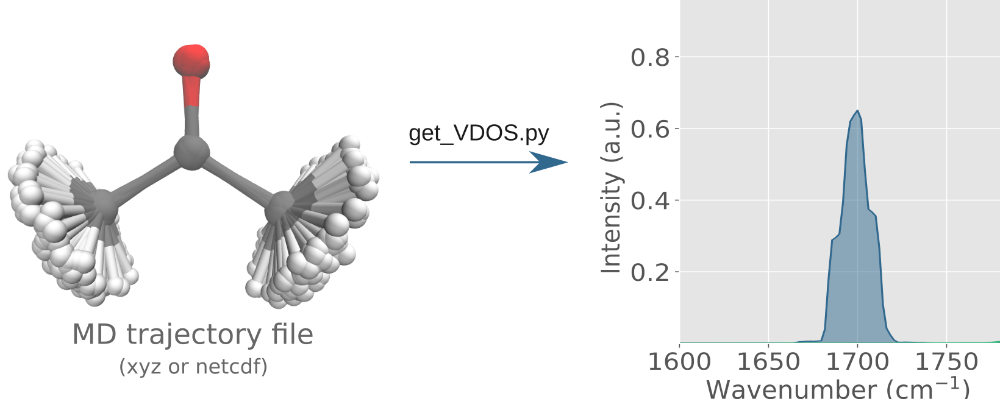

# Get VDOS (Vibrational Density of States) from Molecular Dynamics Trajectories



## Overview
This Python script, `get_VDOS.py`, is designed to calculate the Vibrational Density of States (VDOS) from molecular dynamics trajectory files. It supports different file formats and offers flexibility in terms of data processing and analysis.

## Features
- Supports XYZ and NETCDF file formats.
- Option to choose between full and bond-specific modes.
- Various windowing functions for Fourier Transform: Gaussian, Blackman-Harris, Hamming, Hann.
- Option for numerical or file-based velocity calculations.
- Autocorrelation Function (ACF) calculation and FFT for VDOS computation.

## Requirements
- Python 3
- Libraries: NumPy, SciPy, ASE (for XYZ files)
- A trajectory file in either XYZ or NETCDF format.

## Installation
Clone this repository or download `get_VDOS.py` directly. Ensure you have the required Python version and libraries installed.

```console
git clone https://github.com/JonathanSemelak/VDOS.git
cd VDOS
```

## Usage
Run the script from the command line with the required arguments.

```console
python get_VDOS.py -i [input file] -o [output file] -dt [delta time] [other optional arguments]
```

### Command-Line Arguments
- `-i`, `--input`: Input file name (required).
- `-o`, `--output`: Output file name (required).
- `-m`, `--mode`: Mode of operation ('full' or 'bond', default: 'full').
- `-dt`, `--delta_t`: Delta time in femtoseconds (required).
- `-b`, `--bond`: Bond indices (two integers, required if mode is 'bond').
- `-w`, `--window_kind`: Window kind for FFT (default: 'Gaussian').
- `-f`, `--force_numerical`: Force numerical calculation of velocities (default: False).
- `-n`, `--use_normalized_vectors`: Use the norm of the coordinates (or velocities) instead of individual coordinates (default: False).


### Examples
```console
python get_VDOS.py -i trajectory.xyz -o vdos_output.txt -dt 0.5
```

## Output
The script outputs the VDOS data in the specified output file, including wavenumbers and intensity values.

## Contributing
Contributions, issues, and feature requests are welcome. Feel free to check [issues page](link-to-your-issues-page) if you want to contribute.

## Acknowledgments
This project incorporates modified functions from [Velocity-ACF](https://github.com/LePingKYXK/Velocity-ACF) by HUAN WANG. We thank the author for their valuable work which formed a foundation for some of the features in this project.
